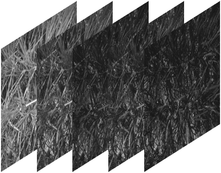
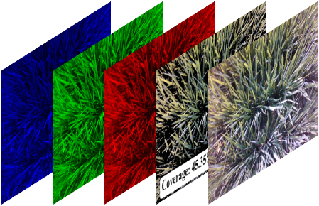

<h1 align=center>SHAP PHENOTYPING</h1>
A framework for phenotyping analysis leveraging SHAP (SHapley Additive Explanations) to interpret model outputs, integrated with multi-source data (imagery + meteorological records).

## Introduction
This project focuses on phenotyping analysis by fusing **multi-source data** for feature extraction, followed by training machine learning models and using SHAP to interpret model decision-making processes. Key data sources include multi-spectral imagery, RGB imagery, and meteorological records from weather stations, with core phenotypic features extracted from the two imagery files as illustrated below.

## Data Sources
All features utilized in this project are derived from 3 core data types, with detailed imagery visualizations and functional explanations provided as follows:

### 1. Multi Spectral Imagery 
This imagery captures the reflection characteristics of objects across multiple spectral bands (474 nm, 566 nm, 679 nm, 717 nm, 822 nm), rendering it indispensable for quantifying vegetation growth status and physiological traits.Example datasets are available in the directory [resource/data/Multispectral/RUGAO/2024](./resource/data/Multispectral/RUGAO/2024).

<div align=center></div>
<div align=center>Figure 1: Multi Spectral Imagery</div>

#### Key Function & Extracted Feature
- **Imagery Role**: Identifies subtle differences in vegetation health, biomass, and physiological characteristics that are imperceptible to the naked eye (e.g., near-infrared bands effectively reflect vegetation vigor and photosynthetic capacity).
- **Extracted Feature**: `Vegetation index` (e.g., NDVI, EVI, GNDVI) — These indices are computed from multi-spectral bands to quantitatively assess vegetation coverage, growth dynamics, and environmental stress levels.

### 2. RGB Images 
This is a standard visible-light image composed of Red, Green, and Blue channels, which reflects the natural visual appearance of research objects and contains rich color and texture information for phenotypic analysis.Example datasets are available in the directory [resource/data/RGB/RUGAO/2024](./resource/data/RGB/RUGAO/2024).

<div align=center></div>
<div align=center>Figure 2: RGB Image</div>


#### Key Function & Extracted Features
- **Imagery Role**: Provides intuitive visual information about target scenes, serving as the foundation for extracting color and texture-related features, as well as for both manual and automated calculation of canopy coverage.
- **Extracted Features**:
  1. `Color index`: Derived from RGB channel ratio calculations (e.g., ExG, ExR) to characterize vegetation color traits (e.g., leaf chlorophyll content and nutrient status).
  2. `Texture feature`: Extracted via algorithms such as the Gray Level Co-occurrence Matrix (GLCM), reflecting the spatial distribution pattern of pixel gray values (e.g., the smoothness or coarseness of vegetation canopies).
  3. `Canopy coverage`: The proportion of vegetation canopy area to the total image area, calculated through image segmentation and thresholding algorithms to reflect vegetation density and growth uniformity.

### 3. Meteorological Data
- **Source**: Weather monitoring stations
- **Feature Set**: `Meteorological_Factor` (e.g., daily average temperature, cumulative precipitation, relative humidity, solar radiation) — These factors provide critical environmental context for understanding vegetation growth and phenotypic variation.

### Data Consolidation & Feature Categorization
All extracted imagery features and meteorological data are consolidated into the `data_all.xlsx` file, with feature columns categorized as follows:

```python
# Vegetation Indices Features
Vegetation_Index = [
    'RVI', 'CIgreen', 'Cired', 'MDD', 'Int1', 'Int2',
    'Red-Edge NDVI', 'GARI', 'SIPI', 'ARVI', 'EVI',
    'GNDVI', 'NDVI', 'SAVI', 'VARI_1', 'NDI'
]

# Canopy Coverage Feature
coverage = ['coverage']

# Color Indices Features
Color_Index = ['ExG', 'ExR', 'ExGR', 'VARI_2', 'GLI', 'WI']

# Texture Indices Features
Texture_Feature = [
    'R_Mean', 'R_Variance', 'R_Homogeneity', 'R_Contrast',
    'R_Dissimilarity', 'R_Entropy', 'R_Second Moment', 'R_Correlation',
    'G_Mean', 'G_Variance', 'G_Homogeneity', 'G_Contrast',
    'G_Dissimilarity', 'G_Entropy', 'G_Second Moment', 'G_Correlation',
    'B_Mean', 'B_Variance', 'B_Homogeneity', 'B_Contrast',
    'B_Dissimilarity', 'B_Entropy', 'B_Second Moment', 'B_Correlation'
]

# Meteorological Features
Meteorological_Factor = [
    "2m Average Temperature (°C)",
    "2m Maximum Temperature (°C)",
    "2m Minimum Temperature (°C)",
    "Precipitation (mm)",
    "Growing Degree Days (GDD)",
    "Relative Humidity (%)",
    "Total Solar Radiation (downward, J/m²)",
    "Peak Sunshine Duration (h)"
]
```

### Growth Stage Classification
Based on the study timeline, vegetation growth is divided into three key stages (indexed by sample sequence):
1. **Jointing Stage**: Samples 1–60
2. **Heading Stage**: Samples 61–120
3. **Filling Stage**: Samples 121–180

## Project Structure
```
SHAP_PHENOTYPING/
├── algorithms/               # Algorithm implementations for phenotyping
│   ├── pls_3d_surfaces_with_tables/  # PLS 3D surface analysis (with result tables)
│   ├── rf_3d_surfaces_with_tables/   # Random Forest 3D surface analysis (with result tables)
│   ├── svr_3d_surfaces_with_tables/  # SVR 3D surface analysis (with result tables)
│   ├── xgb_3d_surfaces_with_tables/  # XGB 3D surface analysis (with result tables)
│   ├── xgboost_3d_surfaces_with_tables/  # XGBoost 3D surface analysis (with result tables)
│   ├── pls_phenotyping.py    # PLS-based phenotyping script
│   ├── rf_phenotyping.py     # Random Forest-based phenotyping script
│   ├── svr_phenotyping.py    # SVR-based phenotyping script
│   └── xgboost_phenotyping.py# XGBoost-based phenotyping script
├── config/                   # Configuration & feature definition
│   ├── __init__.py           # Init file for config module
│   └── feature_definitions.py# Defines feature sets (vegetation/color index, etc.)
├── data_processing/          # Data preprocessing & analysis tools
│   ├── correlation_analysis/ # Correlation analysis utilities
│   │   ├── correlations_analyze.py  # Correlation analysis script
│   │   └── coverage.py       # Canopy coverage calculation script
├── resource/                 # Raw data & imagery resources
│   ├── data_all.xlsx         # Consolidated dataset (features + meteorological data)
│   ├── multi.png             # Multi spectral imagery (for vegetation index extraction)
│   └── rgb.png               # RGB imagery (for color index/texture/coverage extraction)
├── shap_evaluation/          # SHAP-based model interpretation
│   ├── analysis_rf/          # SHAP analysis for Random Forest
│   │   └── shap_rf_phenotyping.py  # SHAP evaluation script for RF
└── README.md                 # Project documentation (this file)
```
## Installation
Follow the step-by-step instructions below to set up the project environment correctly:

1. Clone this repository to your local machine using Git :
   ```bash
   git clone https://github.com/Samuel1997shuai/SHAP_PHENOTYPING.git
   ```

2. Create and activate a dedicated Conda environment named `code_LAI` with Python 3.9 (to avoid dependency conflicts with other projects):
   ```bash
   # Create the Conda environment
   conda create -n code_LAI python=3.9 -y
   
   # Activate the environment (Windows: conda activate code_LAI)
   source activate code_LAI  # For macOS/Linux
   # conda activate code_LAI  # For Windows Command Prompt/Anaconda Prompt
   ```

3. Navigate to the project root directory and install all required dependencies (a complete list is formally documented in `requirements.txt`):
   ```bash
   # Enter the project root folder (replace "SHAP_PHENOTYPING" with your actual cloned folder name)
   cd SHAP_PHENOTYPING
   
   # Install dependencies via pip
   pip install -r requirements.txt
   ```

### Notes
- Ensure you have [Anaconda](https://www.anaconda.com/download) or [Miniconda](https://docs.conda.io/en/latest/miniconda.html) installed before executing the Conda environment commands.

## Core Component Details

### 1. `config/feature_definitions.py` - Feature Central Management Module
#### File Overview
This file serves as a centralized management hub for all phenotypic and environmental features, enabling cross-script reuse of feature lists, feature type mappings, and consolidated feature collections. It uses UTF-8 encoding and includes detailed docstrings to clarify its functional role.

#### Core Modules & Implementation Details
##### Feature List Definitions (Preserve Original Format Including Trailing Spaces)
- **Vegetation_Index**: A list of 16 vegetation indices (e.g., RVI, NDVI, EVI) derived from multi-spectral imagery, with some entries retaining trailing spaces to match raw data formatting.
- **coverage**: A single-feature list containing the coverage metric, which represents canopy coverage extracted from RGB imagery.
- **Color_Index**: A list of 6 color indices (e.g., ExG, ExR, GLI) calculated from RGB channel ratios, with partial entries having trailing spaces for data consistency.
- **Texture_Feature**: A comprehensive list of 24 texture features (8 features per R/G/B channel), including Mean, Variance, Homogeneity, Contrast, Dissimilarity, Entropy, Second Moment, and Correlation (derived from GLCM algorithm).
- **Meteorological_Factor**: A list of 8 environmental factors (e.g., temperature, precipitation, solar radiation) collected from weather monitoring stations, with metric units clearly specified for each entry.

##### Feature Type Mapping Dictionary (`feature_types`)
Constructed via dictionary unpacking to map each individual feature to its corresponding category (5 categories total: Vegetation Index, Coverage Index, Color Index, Texture Feature, Meteorological Factor). This mapping enables automated feature classification in subsequent analysis (e.g., correlation analysis, visualization grouping).

##### Consolidated Total Feature List (`all_features`)
Merges all 5 feature lists in a fixed category order (Vegetation Index → Coverage Index → Color Index → Texture Feature → Meteorological Factor) to form a unified feature collection for batch processing. Eliminates the need for redundant feature list definitions across different scripts.

### 2. `data_processing/correlation_analysis/correlations_analyze.py` 
### <font color=green>Generate Fig. 4 and Fig. 5 in our paper</font>
#### File Overview
This script serves as the core tool for conducting comprehensive correlation analysis between phenotypic/environmental features and the target variable (LAI). It outputs a variety of statistical tables and standardized visualizations for each growth stage and the overall dataset.

#### Core Modules & Implementation Details
1. **Dependency Import & Path Configuration**
   - Imports key libraries for data processing (`pandas`), visualization (`matplotlib`, `seaborn`), statistical analysis (`scipy.stats`), and system operations (`os`, `sys`, `re`, `warnings`).
   - Configures path resolution: Adds the project root directory to the system path to enable importing of `all_features` and `feature_types` from `config.feature_definitions`.
   - Disables warning prompts to keep the console output clean.

2. **Global Parameter Definition**
   - `DATA_PATH`: Path to the consolidated dataset (`data_all.xlsx`).
   - `TARGET_COL`: Target variable for correlation analysis (set to `LAI`).
   - `SIGNIFICANCE_LEVEL`: Statistical significance threshold (set to 0.05).
   - `OUTPUT_ROOT_DIR`: Root directory for saving analysis results (automatically created if it does not exist).

3. **Pearson Correlation Calculation (`calculate_pearson_correlation`)**
   - **Functionality**: Computes Pearson correlation coefficients and corresponding p-values between each feature and the target variable (LAI).
   - **Key Steps**:
     1. Iterates through all features, skipping features not present in the dataset or with insufficient valid data (fewer than 2 non-null samples).
     2. Extracts valid feature and target data for statistical calculation.
     3. Calculates the correlation coefficient and p-value via `scipy.stats.pearsonr`.
     4. Assigns feature types using the `feature_types` mapping and marks features as significant if their p-value is below the threshold.
   - **Output**: Returns a sorted DataFrame (by absolute correlation coefficient, descending) containing feature names, correlation coefficients, p-values, significance flags, and feature types.

4. **Visualization & Data Saving Functions**
All visualization functions generate both high-resolution images (300 DPI) and corresponding Excel data tables, with automatic directory creation for each growth stage:
   - `clean_filename()`: Cleans illegal characters in filenames (e.g., `<>,:"/\|?*()`) and replaces them with underscores to avoid file saving errors.
   - `save_heatmap()`: Generates a lower-triangle correlation heatmap (using `RdBu_r` colormap) and saves the correlation matrix as an Excel table.
   - `save_barplot()`: Creates a horizontal bar plot of feature correlation coefficients, color-coded by feature type, with value labels and a legend for feature categories.
   - `save_type_mean_plot()`: Generates a horizontal bar plot of mean correlation coefficients (with standard deviation error bars) for each feature type, sorted by absolute mean correlation.
   - `save_pairplot()`: Creates a pairwise scatter matrix for the top 8 features + target variable, with correlation coefficients annotated in the upper triangle and histograms on the diagonal.
   - `save_histogram_corr()`: Plots a distribution histogram (with KDE curve) of correlation coefficients, and saves key statistics (mean, median, standard deviation, etc.) as an Excel table.
   - `save_scatter_fit()`: Generates scatter plots with linear regression lines for each feature vs. LAI, annotates the regression equation and R² value, and saves all regression parameters (slope, intercept, etc.) as an Excel table.
   - `save_top_features_plot()`: Visualizes the top N positive and negative correlation features (default N=8) with color-coded bars for positive/negative correlations.
   - `save_significance_plot()`: Creates a bar plot of the proportion of significant features for each feature type, with percentage labels on top of each bar.

5. **Main Program Logic (`if __name__ == '__main__'`)**
   - **Font Configuration**: Sets the font to `Times New Roman` for English visualization and disables Unicode minus signs for proper plot rendering.
   - **Data Loading**: Loads the consolidated dataset and prints the dataset shape for verification.
   - **Growth Stage Segmentation**: Divides the dataset into 4 subsets (Jointing Stage: 1–60, Heading Stage: 61–120, Filling Stage: 121–180, and Overall dataset).
   - **Batch Processing**:
     1. Creates a dedicated directory for each growth stage.
     2. Computes correlation coefficients and saves the full correlation table.
     3. Generates all 8 types of visualizations and corresponding data tables in sequence.
     4. Prints progress updates for each step and confirms completion for each growth stage.
   - **Final Confirmation**: Prints the path where all results are saved once processing is complete.

#### Output Results
- For each growth stage (Jointing_Stage, Heading_Stage, Filling_Stage, Overall), a subdirectory is created under `./correlation_analysis` containing:
  1. Statistical tables (Excel format): Correlation matrices, regression parameters, feature significance statistics, etc.
  2. Visualizations (PNG format): Heatmaps, bar plots, scatter matrices, regression plots, etc., with high resolution (300 DPI).

### 3. `data_processing/correlation_analysis/coverage.py` - Canopy Coverage Calculation & Image Segmentation Script
#### File Overview
This script is dedicated to calculating vegetation canopy coverage from RGB images and performing vegetation-soil background segmentation. It batch processes images from 60 target folders, uses the `2g-r-b` (2×Green - Red - Blue) vegetation extraction algorithm to separate vegetation from background, saves segmented images, and outputs canopy coverage statistics for each image in a CSV file.

#### Core Modules & Implementation Details
1. **Initialization Configuration**
   - **Segmentation Image Directory Creation**: Defines `segmentation_dir` (named `segmented_images_b`) as the root directory for saving segmented images, and creates the directory if it does not exist (using `os.makedirs` with `exist_ok=True`).
   - **CSV File Initialization**: Creates a `canopy_coverage.csv` file, defines the CSV header fields (`folder`, `a_coverage`, `c_coverage`, `e_coverage`), and writes the header row using `csv.DictWriter` to record folder numbers and corresponding canopy coverage of `a.jpg`, `c.jpg`, `e.jpg`.

2. **Batch Folder Traversal**
   - Iterates through 60 folders (numbered 1 to 60) with the folder path formatted as `../resource/rgb/{folder_num}`.
   - For each folder:
     1. Creates a dedicated subdirectory under `segmentation_dir` (named after the folder number) to save segmented images of the current folder.
     2. Checks if the target folder exists; if not, prints a skip message and proceeds to the next folder.
     3. Initializes a result dictionary (`results`) with keys corresponding to CSV fields, defaulting the coverage values to `None` (for images that may be missing).

3. **Image Processing Pipeline (for `a.jpg`, `c.jpg`, `e.jpg`)**
For each of the three target images in the folder, the script executes the following processing steps:
   - **Image Existence Check**: Verifies if the image file exists; if not, prints a prompt and keeps the corresponding coverage value as `None`.
   - **Image Reading**: Reads the original image using `cv2.imread`, wrapped in a `try-except` block to catch and handle unexpected errors during image processing.
   - **2g-r-b Vegetation Segmentation Algorithm**:
     1. **Image Preprocessing**: Converts the original image to a float32 array (normalized to 0-1 range) to ensure precision for subsequent calculations.
     2. **Channel Splitting**: Splits the BGR-formatted image (OpenCV default) into blue (`b`), green (`g`), and red (`r`) single-channel arrays.
     3. **Gray Scale Calculation for Vegetation Highlighting**: Computes a custom gray scale using the formula `gray = 2.4 * g - b - r` to enhance the contrast between vegetation (high green channel values) and soil/background.
     4. **Normalization & Otsu's Binarization**:
        - Normalizes the custom gray scale to the 0-255 range and converts it to uint8 type (required for OpenCV thresholding).
        - Applies Otsu's automatic thresholding (`cv2.THRESH_OTSU`) to generate a binary image (`th`), where vegetation pixels are white (255) and background pixels are black (0).
   - **Segmented Image Generation & Saving**:
     1. **Mask Creation**: Converts the binary image to a 3-channel mask (normalized to 0-1 range) for pixel-wise operation with the original color image.
     2. **Background Replacement**: Creates a pure black background image of the same size as the original image, then combines the original image with the black background using the mask: vegetation areas retain their original color, while background areas are set to black.
     3. **Image Saving**: Saves the segmented image to the corresponding folder subdirectory with the filename formatted as `{image_prefix}_segmented.jpg` (e.g., `a_segmented.jpg`), and prints the save path for verification.
   - **Canopy Coverage Calculation**:
     1. Computes the proportion of white pixels (vegetation) in the binary image: `coverage = (sum of white pixels) / (total pixels) * 100`.
     2. Rounds the coverage value to 2 decimal places and prints the result (folder number + image name + coverage percentage).
     3. Stores the calculated coverage value in the `results` dictionary, mapping `a.jpg` to `a_coverage`, `c.jpg` to `c_coverage`, and `e.jpg` to `e_coverage`.
   - **Exception Handling**: Catches any exceptions during image processing, prints the error message and affected image path, and continues processing the next image/folder without terminating the script.

4. **CSV Result Writing**
   - After processing all three images in a folder, opens `canopy_coverage.csv` in append mode, and writes the `results` dictionary (folder number + coverage values) as a new row to the CSV file using `csv.DictWriter.writerow`.

#### Output Results
1. **Segmented Image Directory Structure**
   - Root directory: `segmented_images_b/`
   - Subdirectories: `1/`, `2/`, ..., `60/` (one for each original folder)
   - Each subdirectory contains segmented images: `a_segmented.jpg`, `c_segmented.jpg`, `e_segmented.jpg` (only for existing original images)
2. **Canopy Coverage CSV File (`canopy_coverage.csv`)**
   - Columns: `folder` (folder number), `a_coverage` (coverage of `a.jpg`, %), `c_coverage` (coverage of `c.jpg`, %), `e_coverage` (coverage of `e.jpg`, %)
   - Rows: One row per folder (60 rows total), with `None` values for missing images
   - Format: Comma-separated values, compatible with Excel and other data analysis tools

### 4. `algorithms/rf_phenotyping.py` (Other Algorithms: PLS/SVR/XGBoost Follow the Same Framework) - Random Forest (RF) Regression Complete Toolkit
### <font color=green>Generate Table 5 and Fig. 6 and Fig. 7 and Fig. 9 in our paper</font>
#### File Overview
This script implements a comprehensive analytical toolkit encompassing Random Forest Regression, PLS, XGBoost, and SVR, which is specifically tailored for vegetation phenotyping analysis. To illustrate its practical application, we take Random Forest (RF) as an illustrative example. This toolkit features full functional consistency across all versions and adopts a unified rf_ prefix for all output files and directories. Additionally, it executes a complete end-to-end workflow that includes parameter grid search, 3D performance visualization, generation of statistical tables for R² and RMSE metrics, Origin-style fitting plots, independent analysis of single feature groups, and preservation of true and predicted values.

#### Core Modules & Implementation Details
1. **Dependency Import & Environment Configuration**
   - **Basic Dependencies**: Imports libraries for data processing (`pandas`, `numpy`), visualization (`matplotlib`, `mpl_toolkits.mplot3d`), model evaluation (`sklearn`), and system operations (`os`, `sys`, `warnings`, `itertools`), with additional `DummyRegressor` for baseline model construction.
   - **Feature Definition Import**: Adds the project root directory to the system path to import feature lists from `config.feature_definitions`.
   - **Environment Initialization**: Disables warning prompts, sets Chinese font (`SimHei`) for visualization, fixes negative sign display issues, and prints environment status for verification.

2. **Experiment Parameter Configuration (`ExperimentConfig` Class)**
   Using `rf_` prefix for output-related settings:
   - **Data Related**: Dataset path (`DATA_PATH`), target variable (`TARGET_COL = 'LAI'`), and missing value handling method (`MISSING_VALUE_HANDLER`).
   - **Dataset Splitting**: Random seed (`RANDOM_STATE`), test set ratio (`TEST_SIZE`), and minimum test sample count (`MIN_TEST_SAMPLES`).
   - **Output Configuration**: Root directory for results (`OUTPUT_ROOT = './rf_3d_surfaces_with_tables'`), image resolution (`FIG_DPI = 300`), figure size, and colormap for 3D surface plots (`SURFACE_CMAP = 'jet'`).
   - **Algorithm Core Parameter Grids**:
     - RF: `n_estimators` vs `mtry`
     - PLS: `scale_opts` vs `n_components`
     - SVR: `lg(gamma)` vs `lg(C)`
     - XGBoost: `n_estimators` vs `max_depth`
   - **Visualization & Group Configuration**: Growth period division (3 individual periods + full period), 6 major feature groups + all features, plot colors, and statistical table columns, fully consistent with the PLS version.

3. **Output Directory Initialization**
   Creates a hierarchical directory structure for RF results, with all directories prefixed with `rf_`:
   - Root directory: `rf_3d_surfaces_with_tables/`
   - Subdirectories:
     - `rf_data_tables/`: For saving various statistical CSV/Excel tables (grid search results, performance statistics, true/predicted values).
     - `rf_plots/`: For saving global visualization charts (3D surface plot, Origin-style fitting plot for all features).
     - `rf_feature_group_plots/`: For saving independent visualization charts of each feature group (with subdirectories named after each feature group).

4. **Utility Functions (RF Exclusive Logic)**
   - **Evaluation Metrics**: `calc_rmse()` (calculates Root Mean Square Error) and `calc_r2()` (calculates coefficient of determination R²), consistent with the PLS version.
   - **Surface Grid Generation**: `create_surface_grid()` (generates smooth 3D grid data via cubic interpolation) for 3D performance plotting.
   - **Baseline Model (RF Exclusive)**: `get_baseline_rmse()` (trains a mean prediction model as the performance baseline).
   - **RF Model Training**: `train_rf_model()` (model training, supports baseline model fallback when `n_estimators=0`, returns R²/RMSE).
   - **Table Saving Functions**:
     - `save_rf_grid_table()`: Saves grid search results with `rf_` prefixed filenames.
     - `create_rf_performance_table()`/`save_rf_performance_table()`: Generates and saves R²/RMSE statistics tables for each feature group and growth period (Excel + CSV formats).
   - **True/Predicted Value Saving**: `save_rf_true_pred_csv()` (saves true values, predicted values, growth period labels, and evaluation metrics to CSV, with a note row for metric summary).
   - **Visualization Functions**:
     - `collect_rf_true_pred_data()`: Collects true/predicted data for all features across all growth periods.
     - `plot_rf_origin_style_results()`: Generates Origin-style fitting plots with growth period scatter points, individual fitting lines, and overall fitting lines.
   - **Single Feature Group Processing**:
     - `collect_single_feature_group_rf_data()`: Collects true/predicted data and evaluation metrics for individual feature groups.
     - `plot_single_feature_group_rf_visualization()`: Generates independent Origin-style fitting plots for each feature group, with unique colors for each group.

5. **Data Processing Module**
   - `load_and_preprocess_data()`: Loads the consolidated dataset (`data_all.xlsx`), verifies the existence of features and target variables, handles missing values (drop/fill), adaptively sets the `MTRY_GRID` based on the number of features, and returns the preprocessed dataframe and feature/target arrays.

6. **RF Grid Search**
   - `run_rf_grid_search()`: Executes multi-parameter grid search for RF (`n_estimators × mtry`), trains models on the train set, evaluates performance on the test set, saves full search results to CSV, counts valid parameter combinations, and finds the optimal parameters (minimum RMSE), with real-time progress printing during the search process.

7. **RF 3D Surface Plotting**
   - `plot_rf_3d_surface_match_example()`: Generates a 3D performance surface plot matching the example style ("n_estimators vs mtry → RMSE"), uses cubic interpolation to generate smooth grid data, sets the viewing angle (`elev=30, azim=135`) to match the example, adds a color bar for RMSE, and saves the plot with a `rf_` prefix.

8. **Main Function (`main()`)**
   The core workflow function, executing the following steps in sequence:
   1. **Data Preprocessing**: Loads and cleans the dataset, adaptively configures RF parameters.
   2. **Standardization**: Scales the feature matrix using `StandardScaler`.
   3. **Baseline Model Training**: Trains a mean prediction model and calculates baseline RMSE.
   4. **RF Grid Search**: Executes parameter search and obtains optimal parameters.
   5. **3D Surface Plot**: Generates and saves the RF performance 3D surface plot (matching the example style).
   6. **Grid Table Saving**: Saves grid search results to CSV.
   7. **Performance Statistics**: Generates and saves RF performance statistics tables (Excel + CSV formats).
   8. **All Features Visualization**: Collects true/predicted data for all features, saves CSV, and generates Origin-style fitting plots.
   9. **Single Feature Group Processing**: Processes 6 major feature groups independently, saves each group's true/predicted CSV, generates independent fitting plots, and optionally saves a summary CSV of all feature groups.
   10. **Result Summary**: Prints the list of all output files and confirms successful execution, with exception handling to print error information and stack traces.

#### Output Results
1. **Directory Structure (All with `rf_` Prefix)**
   ```
   rf_3d_surfaces_with_tables/
   ├── rf_data_tables/          # Statistical tables (CSV/Excel)
   ├── rf_plots/                # Global visualization charts (PNG)
   └── rf_feature_group_plots/  # Single feature group visualization charts
       ├── (A) Vegetation Index/
       ├── (B) Color Index/
       ├── (C) Texture features/
       ├── (D) Meteorological Factor/
       ├── (E) Integration of four features/
       └── (F) Fusion of Four Features and Coverage/
   ```

2. **Key Output Files**
   - **Grid Search & Surface Related**:
     - `rf_full_search_results.csv`: Full RF grid search results (all parameter combinations + R²/RMSE).
     - `rf_grid_results.csv`: Simplified grid search data table.
     - `rf_3d_rmse_match_example.png`: RF 3D performance surface plot (n_estimators vs mtry → RMSE).
   - **Performance Statistics**:
     - `rf_Performance_Table_With_R2_RMSE_Header.xlsx`: Excel format performance statistics table (includes all feature groups and growth periods).
     - `rf_Performance_Table_With_R2_RMSE_Header.csv`: CSV format performance statistics table.
   - **True/Predicted Value Data**:
     - `rf_all_features_true_pred_data.csv`: True/predicted values for all features (with metric notes for each growth period).
     - `rf_*_true_pred_data.csv`: True/predicted values for each single feature group (e.g., `rf_(A)_Vegetation_Index_true_pred_data.csv`).
     - `rf_all_feature_groups_true_pred_summary.csv`: Optional summary CSV of all feature groups' true/predicted data.
   - **Visualization Charts**:
     - `rf_origin_style_fitting_plot_with_all_periods.png`: Origin-style fitting plot for all features (3 growth periods + full growth period).
     - `rf_*_fitting_plot.png`: Independent fitting plots for each single feature group (stored in corresponding feature group subdirectories).

3. **Functionality Characteristics**
   - **Cross-Model Compatibility**: Maintains consistent directory structure, parameter configuration, and output format with the PLS version, facilitating cross-model comparison.
   - **Comprehensive Workflow**: Covers from data preprocessing to model evaluation, visualization, and result saving, supporting one-click execution.
   - **Enhanced Usability**: Adds single feature group independent analysis and true/predicted value saving, improving the usability of result analysis.
   - **High Usability**: All results are saved in standard formats (CSV/Excel/PNG) suitable for further statistical analysis.

### 5. `shap_evaluation/analysis_rf/shap_rf_phenotyping.py` - Random Forest (RF) SHAP Explainability Analysis Tool
### <font color=green>Generate Fig. 8 in our paper</font>
#### File Overview
This script implements a simplified and standardized SHAP (SHapley Additive Explanations) explainability analysis pipeline for the Random Forest regression model, focusing exclusively on the `Four_Features_Plus_Coverage` feature group (vegetation + color + texture + meteorological + coverage features). It generates standardized visualizations and structured data files, with all analyses centered on the top 20 most important features (sorted by mean absolute SHAP values). The pipeline supports only tree-based RF models, outputs static visualizations (avoiding dynamic HTML), and retains complete tabular data for secondary analysis.

#### Core Modules & Implementation Details
1. **Dependency Import & Environment Configuration**
   - **Basic Dependencies**: Imports data processing (`pandas`, `numpy`), visualization (`matplotlib`, `seaborn`, `matplotlib.ticker`), model training/evaluation (`sklearn`), and system operation (`os`, `sys`) libraries, laying the foundation for the entire workflow.
   - **Feature Definition Import**: Adds the project root directory to the system path, imports feature lists with exception handling, and prompts users to verify the existence of `config/feature_definitions.py` if import fails.
   - **SHAP Library Validation**: 
     - First checks if SHAP is installed, prompting installation/upgrade if not.
     - Then verifies key components (e.g., `TreeExplainer`, `summary_plot`) required for analysis, ensuring no functional missing parts.
     - Sets the `SHAP_AVAILABLE` flag to control subsequent analysis execution.
   - **Standardized Plot Configuration**: Configures plot parameters to meet standardized visualization requirements:
     - Font: Arial, font size 10.
     - Axes: Line width 0.8, disable Chinese character garbling, fix negative sign display.
     - Resolution: 300 DPI for both figures and saved images, tight layout to avoid content truncation.
   - **Color Palette**: Defines distinct colors for different types of feature impacts (positive: red, negative: teal, neutral: gray) and plot types (heatmap: viridis, bar plot: blue), ensuring visual consistency and readability.

2. **Global Configuration Constants**
   - **Feature Group Configuration**: Only retains the `Four_Features_Plus_Coverage` feature group, filtering out other feature sets to focus analysis resources.
   - **RF Algorithm Configuration**: Explicitly defines RF as a tree-based model (`model_type='tree'`), with no support for other algorithms (ensuring alignment with SHAP `TreeExplainer`).
   - **Global Constants**: 
     - Target variable: `LAI` (Leaf Area Index), the core prediction object of the phenotyping task.
     - Path configuration: Data path (`../resource/data_all.xlsx`), output root directory (`analysis_shap_rf`).
     - Control parameters: Random seed (`42`) for result reproducibility, `TOP_N_FEATURES=20` (fixed to display the top 20 important features).

3. **Core Utility Functions**
   - **Output Directory Creation (`create_output_directory`)**: 
     - Creates a directory named `{feature_group}+{algorithm}` under the root output directory, ensuring independent storage of results for different feature groups/algorithms.
     - Handles directory creation exceptions and exits gracefully if creation fails.
   - **Data Loading & Preprocessing (`load_and_preprocess_data`)**:
     - Loads the consolidated dataset `data_all.xlsx` and prints the data shape for verification.
     - Checks for the presence of required columns (target features + LAI), exiting if any columns are missing.
     - Cleans data by removing rows with missing values and prints the data shape before/after cleaning.
     - Standardizes features using `StandardScaler` (retained for compatibility with subsequent analysis) and splits data into training (70%) and test (30%) sets.
     - Returns preprocessed data arrays and objects for subsequent model training.
   - **RF Model Training (`train_rf_model`)**:
     - Initializes a Random Forest regressor (100 trees, max depth 10, parallel computing with `n_jobs=-1`).
     - Trains the model on the training set and predicts on both training and test sets.
     - Calculates evaluation metrics (R², RMSE) for both sets, prints them for real-time performance monitoring, and returns the trained model and metrics.
   - **SHAP Explainer Creation (`get_shap_explainer`)**:
     - Only supports tree-based models (RF), creates and returns a `shap.TreeExplainer` (with training set as background data to ensure explanation rationality).
     - Throws an error for unsupported model types and returns `None` if creation fails.
   - **Auxiliary Functions**:
     - `get_most_accurate_sample_idx`: Finds the index of the sample with the smallest prediction error (most accurate prediction) for single-sample SHAP visualization.
     - `get_top_n_feature_indices`: Sorts features by mean absolute SHAP values in descending order and returns the indices of the top 20 features.
     - `save_shap_data`: Saves complete SHAP analysis data:
       - CSV file: Stores full SHAP values, sample indices, true values, predicted values, and prediction errors for all test samples.
       - Excel file: Contains 3 worksheets (`feature_importance` with top 20 feature markers, `model_performance` with training/test metrics, `top_100_samples` with SHAP data for the first 100 samples).

4. **Retained Visualization Functions (4 Standardized Plots)**
   - **Model Built-in Feature Importance Plot (`plot_model_builtin_importance`)**:
     - Extracts `feature_importances_` from the RF model (native feature importance metric).
     - Selects the top 20 features, draws a horizontal bar plot (blue color), and inverts the y-axis to place the most important feature at the top.
     - Saves the plot as `model_builtin_importance.png` with a figure size of (10,9) to accommodate 20 features.
   - **SHAP Summary Beeswarm Plot (`plot_shap_summary_beeswarm`)**:
     - Uses SHAP's native color scheme (no custom colors) to display the distribution of SHAP values for the top 20 features.
     - Each point represents a sample's SHAP value for a feature, reflecting both the magnitude (horizontal position) and direction (color) of the feature's impact on predictions.
     - Saves the plot as `shap_summary_beeswarm.png` with a figure size of (12,11) to ensure clarity of 20 features.
   - **SHAP Waterfall Plot (`plot_shap_waterfall`)**:
     - Focuses on the most accurate sample (smallest prediction error), visualizing the contribution of the top 20 features to the prediction result.
     - Shows the transition from the model's expected value (baseline) to the actual prediction value, with each bar representing the positive/negative contribution of a feature.
     - Returns the plot path, top 20 feature SHAP explanation object, and most accurate sample index for subsequent force plot generation; saves the plot as `shap_waterfall.png`.
   - **SHAP Force Plot (Static Matplotlib Version) (`plot_shap_force_plot_matplotlib`)**:
     - Generates static PNG images with only Matplotlib, avoiding dynamic HTML formats.
     - Rounds all numerical values (baseline, SHAP values, feature values) to 3 decimal places for precision, and widens the figure (25,3) to accommodate 20 features.
     - Uses the `RdBu` color map to show positive/negative contributions, sets a contribution threshold of 0.05 to filter trivial impacts, and saves the plot as `shap_force_plot.png`.

5. **SHAP Core Analysis Pipeline (`run_shap_analysis`)**
   - First checks if SHAP is available; skips analysis if not.
   - Retrieves RF algorithm information, creates the output directory, and initializes a dictionary to record plot information.
   - Retrains the RF model (for consistency) and creates a SHAP `TreeExplainer`; skips subsequent steps if the explainer creation fails.
   - Computes SHAP values for the test set, handles format differences (e.g., multi-output compression), and creates a standardized `shap.Explanation` object.
   - Generates the 4 retained visualizations in sequence, records valid plot information, and saves all SHAP tabular data (CSV + Excel).
   - Returns the plot information dictionary for traceability.

6. **Main Workflow (`main`)**
   - Prints the analysis overview (target feature group, top 20 features, retained plots) to clarify the pipeline scope.
   - Loads and preprocesses data, creates the root output directory.
   - Focuses on the `Four_Features_Plus_Coverage` feature group, filters valid features, and prompts warnings if any features are missing.
   - Trains the RF baseline model to obtain prediction results and evaluation metrics.
   - Runs the SHAP analysis pipeline to generate visualizations and save data.
   - Prints the completion information, including the output path, key settings, and retained resources, to guide users in locating results.

#### Output Results
1. **Directory Structure**
   ```
   analysis_shap_rf/
   └── Four_Features_Plus_Coverage+Random_Forest/  # Feature group + algorithm directory
       ├── model_builtin_importance.png           # Model native feature importance plot (top 20)
       ├── shap_summary_beeswarm.png              # SHAP summary beeswarm plot (top 20)
       ├── shap_waterfall.png                     # SHAP waterfall plot (most accurate sample, top 20)
       ├── shap_force_plot.png                    # SHAP static force plot (3 decimals, top 20)
       ├── shap_values_Random_Forest.csv          # Full SHAP values + sample/prediction information
       └── shap_analysis_summary_Random_Forest.xlsx  # SHAP analysis summary (3 worksheets)
   ```

2. **Key Output Files**
   - **Visualization Files**: 4 PNG images with 300 DPI resolution, tight layout, and standardized styles, all focusing on the top 20 features.
   - **Tabular Data Files**:
     - `shap_values_Random_Forest.csv`: Contains full SHAP values for each feature, sample index, true/predicted values, and prediction errors, supporting secondary statistical analysis.
     - `shap_analysis_summary_Random_Forest.xlsx`:
       - `feature_importance`: Sorted feature importance metrics (mean absolute SHAP, max/min/median SHAP) with a marker for top 20 features.
       - `model_performance`: RF model training/test R² and RMSE for performance tracking.
       - `top_100_samples`: SHAP data for the first 100 test samples, facilitating quick inspection of typical results.

#### Script Characteristics
1. **Focused and Streamlined**: Exclusively targets the specified feature group and RF model, eliminating redundant processing of other algorithms/feature sets to improve execution efficiency.
2. **Standardized Visualization**: All visualizations adopt unified formatting, and data formats are compatible with common analysis tools (Excel, CSV).
3. **Practicality-Oriented**: Retains core explainability visualizations and complete tabular data, focuses on the top 20 features to avoid information overload, and generates static plots for easy storage and sharing.
4. **High Robustness**: Includes multiple exception handling mechanisms (dependency verification, file path checking, directory creation), with clear prompts to reduce user operation errors.
5. **Reproducible Results**: Fixes the random seed, standardizes preprocessing steps, and ensures that repeated runs yield consistent visualizations and data.
6. **Easy Secondary Analysis**: Saves detailed SHAP values and feature importance metrics, supporting subsequent statistical tests, feature screening, and result verification.


# Statement
1. All figures will be made publicly available upon the acceptance of our paper.
2. Requests for the complete dataset can be directed to [sumiao@stu.njau.edu.cn](mailto:sumiao@stu.njau.edu.cn) or [zhoudong@njau.edu.cn](mailto:zhoudong@njau.edu.cn).
3. For technical inquiries regarding code implementation, please contact [luoshaoyang@stu.njau.edu.cn](mailto:luoshaoyang@stu.njau.edu.cn) or [zhoudong@njau.edu.cn](mailto:zhoudong@njau.edu.cn).
